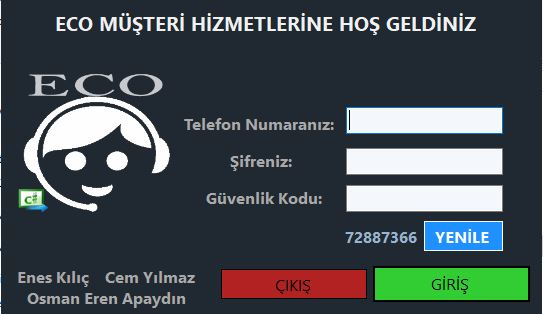

Project Presentation Video: https://drive.google.com/file/d/1wqjpr9IMUXNmj3Chhk_p2Zjoelvkj9pf/view?usp=sharing    
Note: If it does not open directly, first download it and then open it from the computer

  

# Operator Customer Service (C# Console Application)

## Table of Contents
1. [Introduction](#introduction)
2. [Technologies Used](#technologies-used)
3. [Key Features](#key-features)
   - [Balance Management](#balance-management)
   - [TL Transfer](#tl-transfer)
   - [Service Package Management](#service-package-management)
   - [Tariff Customization](#tariff-customization)
   - [Payment Integration](#payment-integration)
   - [Campaign Management](#campaign-management)
   - [Voice Commands](#voice-commands)
4. [System Architecture](#system-architecture)
   - [Core Modules](#core-modules)
   - [Database](#database)
   - [Voice Integration](#voice-integration)
   - [Design Patterns](#design-patterns)
5. [Roles and Contributions](#roles-and-contributions)
   - [Core Development](#core-development)
   - [Database Design](#database-design)
   - [Voice Integration](#voice-integration)
   - [UI Design](#ui-design)
   - [Testing & Optimization](#testing--optimization)
6. [Achievements](#achievements)
7. [Example Usage](#example-usage)
   - [Scenario 1: TL Transfer](#scenario-1-tl-transfer)
   - [Scenario 2: Purchasing a Service Package](#scenario-2-purchasing-a-service-package)
   - [Scenario 3: Voice Commands](#scenario-3-voice-commands)
8. [Future Enhancements](#future-enhancements)
   - [Mobile Application Integration](#mobile-application-integration)
   - [Advanced Voice Recognition](#advanced-voice-recognition)
   - [Campaign Analytics](#campaign-analytics)
   - [Multi-Language Support](#multi-language-support)
   - [Cloud Integration](#cloud-integration)
9. [Installation and Usage](#installation-and-usage)
   - [Prerequisites](#prerequisites)
   - [Steps](#steps)
10. [License](#license)

---

## Introduction
The **Operator Customer Service** is a C# console application designed to streamline operator services for both desktop and mobile platforms. The application provides a comprehensive system to manage customer accounts, balance transactions, service packages, campaigns, and tariffs. With features like voice commands and real-time updates, the system enhances user experience and operational efficiency.

---

## Technologies Used
- **Programming Language**: C#
- **Backend Framework**: .NET Framework
- **Database**: SQL Server with 20+ tables for managing customer and transaction data
- **Design Patterns**: Singleton, Factory, Command, Observer
- **Voice Processing**: Custom voice recognition for interaction

---

## Key Features

### Balance Management
- Load TL, check balance, and track credit usage dynamically.

### TL Transfer
- Transfer TL between operator customers in real time.

### Service Package Management
- Purchase internet, talk time, and SMS packages based on user preferences.

### Tariff Customization
- Modify tariffs or select pre-configured/customized service packages.

### Payment Integration
- Process credit loading and payments via credit card.

### Campaign Management
- Manage promotions, apply discounts, and purchase promotional products.

### Voice Commands
- Simplify operations with voice commands for navigation and interaction.

---

## System Architecture

### Core Modules
- Balance Management
- Service Packages
- TL Transfer
- Campaign Management

### Database
- SQL Server to handle user data, transaction history, and service records.

### Voice Integration
- Custom voice recognition system for hands-free operation.

### Design Patterns
- Utilized design patterns like Singleton for object creation, Factory for service modules, and Observer for real-time updates.

---

## Roles and Contributions

### Core Development
- Developed modules for balance management, TL transfers, and service packages.

### Database Design
- Designed a relational database schema for customer and service data storage.

### Voice Integration
- Integrated a custom voice recognition system for enhanced interaction.

### UI Design
- Designed an intuitive console-based interface for smooth user navigation.

### Testing & Optimization
- Conducted unit tests and optimized system performance for real-time updates.

---

## Achievements
- **Enhanced UX**:
  - Delivered an intuitive system with innovative voice interaction capabilities.
- **Operational Efficiency**:
  - Streamlined workflows for real-time balance synchronization and service updates.
- **Scalability**:
  - Built a scalable architecture for future enhancements and additional features.
- **Recognition**:
  - Noted for pioneering voice integration in a console application.

---

## Example Usage

### Scenario 1: TL Transfer
1. User selects the "TL Transfer" option from the main menu.
2. Enters the recipient's phone number and transfer amount.
3. System validates the transaction and updates both accounts.
4. Confirmation message is displayed:  
   *"Transaction successful! 50 TL has been transferred to 0532xxxxxxx."*

### Scenario 2: Purchasing a Service Package
1. User navigates to the "Service Packages" menu.
2. Selects an internet package (e.g., 10 GB for 50 TL).
3. System deducts the package cost from the user's balance and activates the package.
4. Confirmation message:  
   *"10 GB internet package successfully activated!"*

### Scenario 3: Voice Commands
1. User enables voice command mode.
2. Says: *"Check my balance"*.  
   System responds with:  
   *"Your current balance is 75 TL."*
3. Says: *"Buy 5 GB internet package."*  
   System processes the request and confirms:  
   *"5 GB internet package activated."*

---

## Future Enhancements

### Mobile Application Integration
- Extend the system to include mobile apps for Android and iOS.

### Advanced Voice Recognition
- Improve voice processing capabilities with natural language understanding (NLU).

### Campaign Analytics
- Add analytics tools to evaluate campaign effectiveness and customer preferences.

### Multi-Language Support
- Introduce support for multiple languages for a broader audience.

### Cloud Integration
- Migrate database to a cloud platform for better scalability and accessibility.

---

## Installation and Usage

### Prerequisites
- Visual Studio (2015 or later)
- .NET Framework installed on the development machine
- SQL Server for database setup

### Steps
1. Clone the repository:  
   ```bash
   git clone https://github.com/yourusername/operator-customer-service.git
2. Open the solution in Visual Studio.
3. Configure the database connection in the app's configuration file.
4. Build and run the project.
5. Use the console menu to navigate through the features.
